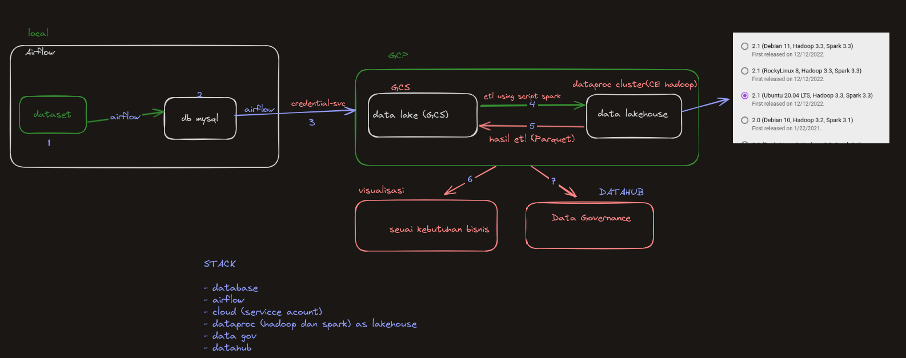

# Proyek Data Engineering

Proyek ini bertujuan untuk membuat data lakehouse menggunakan Google Cloud Platform (GCP) dan berbagai alat serta teknologi untuk mengelola dan menganalisis dataset besar secara efisien. Dokumentasi berikut memberikan gambaran umum tentang arsitektur proyek, stack teknologi, dan langkah-langkah untuk menyiapkan dan menjalankan proyek.

## Arsitektur Proyek

1. **Pengaturan Lokal dengan Airflow**: 
    - **Dataset**: Dataset awal dimuat dan dikelola secara lokal.
    - **Airflow**: Digunakan untuk mengorkestrasi dan menjadwalkan tugas. Dataset dimuat ke dalam database MySQL menggunakan Airflow.
    
2. **Database MySQL**:
    - Dataset diingest ke dalam database MySQL.
    
3. **Transfer Data ke GCS**:
    - **Credential Service**: Airflow menggunakan layanan kredensial(Service-account) untuk mentransfer data dengan aman ke Google Cloud Storage (GCS).
    
4. **ETL dengan Spark di Dataproc**:
    - **GCS**: Data disimpan di GCS sebagai data lake.
    - **Cluster Dataproc**: Cluster Hadoop di Dataproc digunakan untuk menjalankan job Spark yang melakukan operasi ETL (Extract, Transform, Load) pada data.

5. **Data Lakehouse**:
    - Data yang telah diproses disimpan dalam format data lakehouse (file Parquet) di GCS.
    
6. **Visualisasi Bisnis**:
    - Data divisualisasikan sesuai dengan kebutuhan bisnis menggunakan berbagai alat BI.

7. **Governance Data dengan DataHub**:
    - Governance dan manajemen data diatur menggunakan DataHub.

## Stack Teknologi

- **Database**: MySQL
- **Orkestrasi**: Apache Airflow
- **Layanan Cloud**: Google Cloud Platform (GCP)
- **Pemrosesan Data**: Apache Spark di Dataproc
- **Penyimpanan**: Google Cloud Storage (GCS)
- **Governance Data**: DataHub

## Petunjuk Pengaturan

1. **Pengaturan Lingkungan Lokal**:
    - Instal dan konfigurasikan Airflow, MySQL, dan dependensi yang diperlukan.
    - Muat dataset awal ke dalam database MySQL menggunakan DAG Airflow.

2. **Pengaturan Google Cloud Platform**:
    - Buat dan konfigurasikan bucket GCS untuk penyimpanan data.
    - Buat key service account dan key HMAC di bucketnya.
    - Siapkan cluster Dataproc dengan Hadoop dan Spark.

3. **Eksekusi Pipeline Data**:
    - Gunakan Airflow untuk menjadwalkan dan mengelola transfer data dari MySQL ke GCS.
    - Jalankan job Spark di Dataproc untuk memproses dan mentransformasi data.
    - Simpan data yang telah diproses di GCS dalam format Parquet.

4. **Visualisasi dan Governance Data**:
    - Gunakan scrip pyspark untuk membuat visualisasi berdasarkan kebutuhan bisnis.
    - Terapkan kebijakan governance data menggunakan DataHub.

## Penggunaan

- **Airflow**: 
    - Mulai web server dan scheduler Airflow.
    - Pantau dan kelola DAG melalui UI Airflow.

- **Spark di Dataproc**:
    - Submit job Spark ke cluster Dataproc.
    - Pantau eksekusi dan kinerja job menggunakan UI Dataproc.

